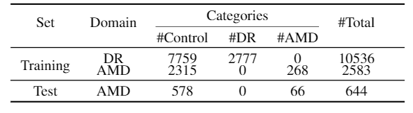

# <center>Task-Heterogeneous Domain Adaptation for Medical Image Diagnosis</center>
We provide the **AMD** dataset for domain adaptation from diabetic retinopathy (DR) to age-related macular degeneration (AMD). The paper is available [here](https://arxiv.org/pdf/2005.01577.pdf).

# Dataset
The descriptions for the **AMD** dataset are presented below. We first provide a link to download the dataset. Next, the data statistics and usage of the dataset will be introduced.
## Download
- The dataset in this paper is available [here](https://pan.baidu.com/s/1bT6dtNkrulcpztEAkQFv6g).

## Data Composition
To make up this dataset, we collected and integrated the following open-source datasets:

- The STARE dataset:http://cecas.clemson.edu/~ahoover/stare/
- The ADAM dataset:https://ai.baidu.com/broad/introduction?dataset=amd
- The dataset of Diabetic Retinopathy Detection Competition on Kaggle:https://www.kaggle.com/tanlikesmath/diabetic-retinopathy-resized

Specifically, we choose part of control cases (non-DR and non-AMD) and diabetic retinopathy cases to make up source diabetic retinopathy (DR) domain, while part of control cases and all age-related macular degeneration cases compose the target age-related macular degeneration (AMD) domain.

## Data Structure and Statistics
- The data structure:
```
all_data_fundus
└── all_data_DR
|  
|
└── all_data_MD
    |
    |── train
    |── val
    └── test
```

- Statistics of the dataset are shown as follow:\
\
Pneumonia ("all_data_DR" sub-directory) serves as the source domain and COVID-19 ("all_data_MD" sub-directory) serves as the target domain.

- You can refer to the [paper](https://arxiv.org/pdf/2005.01577.pdf) for more details about the dataset.

## Usage
- In the directory `./data`, there are two `.pkl` files which record the image lists and its corresponding labels. Specifically, an image and its label is stored in a tuple (image_name, label). "1" denotes class "diabetic retinopathy" (DR) and class "age-related macular degeneration" (AMD) in source and target domain, respectively, while "0" denotes class "control" (non-DR and non-AMD). You can read the data list following the below manner:
  - for the source domain (DR):
  ```
        with open('./data/DR_task.pkl', 'rb') as f:
            train_dict = pickle.load(f)
        train_list = train_dict['train_list'] # train sub-directory
  ```
  - for the target domain (AMD):
  ```
        with open('./data/AMD_task.pkl', 'rb') as f:
            train_dict = pickle.load(f)
        train_list_labeled = train_dict['train_list_labeled'] # labeled data (train sub-directory)
        train_list_unlabeled = train_dict['train_list_unlabeled'] # unlabeled data (train sub-directory)
        val_list = train_dict['val_list'] # val sub-directory
        test_list = train_dict['test_list'] # test sub-directory
  ```
  For convenience, we provide `.pkl` files for both python 2 and 3, respectively.

- According to the image lists, you can load images using Pillow:
  ```
        # e.g., for the source domain (DR)
        for img_tup in train_list:
            img = PIL.Image.open(os.path.join('all_data/all_data_DR', img_tup[0])
            label = img_tup[1]
  ```

# Citation
If you find the **AMD** dataset useful, please cite the following paper:
```
@article{zhang2020covidda,
    title={COVID-DA: Deep Domain Adaptation from Typical Pneumonia to COVID-19},
    author={Yifan Zhang and Shuaicheng Niu and Zhen Qiu and Ying Wei and Peilin Zhao and Jianhua Yao and Junzhou Huang and Qingyao Wu and Mingkui Tan},
    journal={arXiv},
    year={2020},
}
```