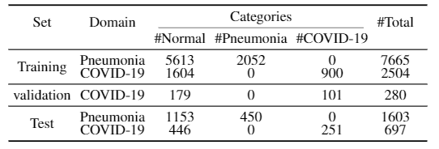

# <center>Task-Heterogeneous Domain Adaptation for Medical Image Diagnosis</center>
We provide the **COVID-19 CT** dataset for domain adaptation from typical pneumonia to COVID-19.

# Dataset
The descriptions for the **COVID-19 CT** dataset are presented below. We first provide a link to download the dataset. Next, details about the dataset and usage of the dataset will be introduced.
## Download
- The dataset is available [here](https://pan.baidu.com/s/1lT3YB_Kr3mtGAtbayYfCKw).

## Data Composition
The dataset is collected from the following open-source datasets:

https://github.com/ieee8023/covid-chestxray-dataset  
https://www.kaggle.com/c/rsna-pneumonia-detection-challenge/data  
https://www.kaggle.com/plameneduardo/sarscov2-ctscan-dataset
https://data.mendeley.com/datasets/8h65ywd2jr/3

Specifically, the fist two datasets are used to construct the Pneumonia source domain (X-ray images), while the rest datasets make up the COVID-19 target domain (CT images).

## Data Structure and Statistics
- The data structure:
```
all_data_ct
└── all_data_pneumonia
|   |
|   ├── train
|   └── val 
|
└── all_data_covid_ct
    |
    |── train
    |── val
    └── test
```

- Statistics of the dataset are shown as follow:\
\
Pneumonia ("all_data_pneumonia" sub-directory) serves as the source domain and COVID-19 ("all_data_covid_ct" sub-directory) serves as the target domain.

## Usage
- In the directory `./data`, there are two `.pkl` files which record the image lists and its corresponding labels. Specifically, an image and its label is stored in a tuple (image_name, label). "1" denotes class "pneumonia" and class "COVID-19" in source and target domain, respectively, while "0" denotes class "normal". You can read the data list following the below manner:
  - for the source domain (Pneumonia):
  ```
        with open('./data/pneumonia_task.pkl', 'rb') as f:
            train_dict = pickle.load(f)
        train_list = train_dict['train_list'] # train sub-directory
        val_list = train_dict['val_list'] # val sub-directory
  ```
  - for the target domain (COVID-19):
  ```
        with open('./data/COVID-19_task.pkl', 'rb') as f:
            train_dict = pickle.load(f)
        train_list_labeled = train_dict['train_list_labeled'] # labeled data (train sub-directory)
        train_list_unlabeled = train_dict['train_list_unlabeled'] # unlabeled data (train sub-directory)
        val_list = train_dict['val_list'] # val sub-directory
        test_list = train_dict['test_list'] # test sub-directory
  ```
  For convenience, we provide `.pkl` files for both python 2 and 3, respectively.

- According to the image lists, you can load images using Pillow:
  ```
        # e.g., for the source domain (Pneumonia)
        for img_tup in train_list:
            img = PIL.Image.open(os.path.join('all_data/all_data_pneumonia', 'train', img_tup[0])
            label = img_tup[1]
  ```